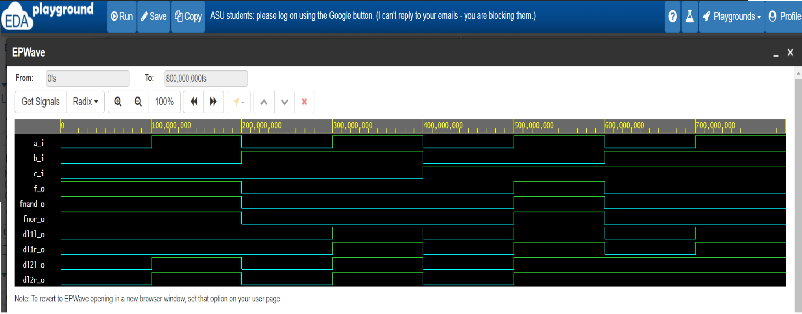

# Úkol 1
Celý úkol jsem vyřešil v jednom skriptu:

[Odkaz na EDA playground](https://www.edaplayground.com/x/X8dp)

[Odkaz na GitHub](https://github.com/JanRajm/Digital-electronics-1)
## Časové průběhy výstupů


## VHDL kód
```vhdl
entity gates is
    port(
        a_i     : in  std_logic;         -- Data input
        b_i     : in  std_logic;         -- Data input
        c_i     : in  std_logic;         -- Data input
        f_o     : out std_logic;         -- first output function
        fnand_o : out std_logic;         -- NAND output function
        fnor_o  : out std_logic;         -- NOR output function
        dl1l_o  : out std_logic;         -- distributive law,first eqation, left side
        dl1r_o  : out std_logic;         -- d.l., first eqation, right side
        dl2l_o  : out std_logic;         -- d.l., second eq., left side
        dl2r_o  : out std_logic          -- d.l., second eq., right side
    );
end entity gates;

------------------------------------------------------------------------
-- Architecture body for basic gates
------------------------------------------------------------------------
architecture dataflow of gates is
begin
    f_o  <= ((not b_i and a_i)or(not c_i and not b_i));               -- Default function
    fnor_o <= (not(b_i or not a_i))or not(c_i or b_i);                -- Modified function using (n)or gates
    fnand_o <= not(not(not b_i and a_i)and not(not c_i and not b_i)); -- Modified function using (n)and gates
-----------------------------------------------------------------------
-- Distributive law
-----------------------------------------------------------------------
    dl1l_o <= (a_i and b_i) or (a_i and c_i);
    dl1r_o <= a_i and (b_i or c_i);
    dl2l_o <= (a_i or b_i) and (a_i or c_i);
    dl2r_o <= a_i or (b_i and c_i);
end architecture dataflow;
```

## Pravdivostní tabulka pro první úkol
| **c** | **b** |**a** | **f(c,b,a)** |
| :-: | :-: | :-: | :-: |
| 0 | 0 | 0 | 1 |
| 0 | 0 | 1 | 1 |
| 0 | 1 | 0 | 0 |
| 0 | 1 | 1 | 0 |
| 1 | 0 | 0 | 0 |
| 1 | 0 | 1 | 1 |
| 1 | 1 | 0 | 0 |
| 1 | 1 | 1 | 0 |
