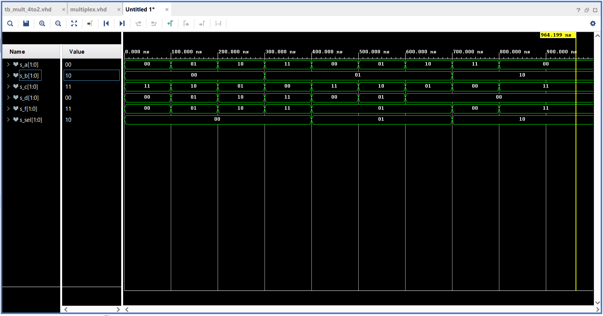

# Cvičení 3

### Architektura
```vhdl
architecture Behavioral of mux_2bit_4to1 is
begin
    f_o <= a_i when (sel_i = "00") else
           b_i when (sel_i = "01") else
           c_i when (sel_i = "10") else
           d_i;

    
end architecture Behavioral;
```

### Stimulus
```vhdl
p_stimulus : process
    begin
        -- Report a note at the begining of stimulus process
        report "Stimulus process started" severity note;


        -- First test values
        s_d <= "00"; s_c <= "11";s_b <= "00"; s_a <= "00"; wait for 100 ns;
        s_d <= "01"; s_c <= "10";s_b <= "00"; s_a <= "01"; wait for 100 ns;
        s_d <= "10"; s_c <= "01";s_b <= "00"; s_a <= "10"; wait for 100 ns;
        s_d <= "11"; s_c <= "00";s_b <= "01"; s_a <= "11"; wait for 100 ns;
        s_d <= "00"; s_c <= "11";s_b <= "01"; s_a <= "00"; wait for 100 ns;
        s_d <= "01"; s_c <= "10";s_b <= "01"; s_a <= "01"; wait for 100 ns;
        s_d <= "00"; s_c <= "01";s_b <= "01"; s_a <= "10"; wait for 100 ns;
        s_d <= "00"; s_c <= "00";s_b <= "10"; s_a <= "11"; wait for 100 ns;
        s_d <= "00"; s_c <= "11";s_b <= "10"; s_a <= "00"; wait for 100 ns;   
        s_d <= "01"; s_c <= "10";s_b <= "10"; s_a <= "01"; wait for 100 ns;
        s_d <= "10"; s_c <= "01";s_b <= "10"; s_a <= "10"; wait for 100 ns;
        s_d <= "11"; s_c <= "00";s_b <= "11"; s_a <= "11"; wait for 100 ns;
        s_d <= "00"; s_c <= "11";s_b <= "11"; s_a <= "00"; wait for 100 ns;
        s_d <= "00"; s_c <= "00";s_b <= "11"; s_a <= "01"; wait for 100 ns;
        s_d <= "00"; s_c <= "01";s_b <= "11"; s_a <= "10"; wait for 100 ns;
        s_d <= "00"; s_c <= "00";s_b <= "11"; s_a <= "11"; wait for 100 ns;
        s_d <= "00"; s_c <= "10";s_b <= "00"; s_a <= "11"; wait for 100 ns;     
      
        -- Report a note at the end of stimulus process
        report "Stimulus process finished" severity note;
        wait;
    end process p_stimulus;
```

## Waveform


## Tutorial

#### Začátek
- zvol v prvním obdélníku možnost **Create project**, dej **Next**
- příslušně pojmenuj projekt, **Next**
- nech zaškrknutý **RTL Project**, **Next**
- objeví se okno se seznamovým oknem, klikni na tlačítko **Create File**
  - v **File Type** zvol VHDL
  - zase pojmenuj, zmáčkni **OK**
- zase **Next**, **Next**
#### Výběr desky
- vyber podokno **Desks** (__ne **Parts**__), najdi příslušnou desku, **Next**
- **Finish**
#### Uvnitř manageru
- odsouhlas název a počkej
- v podokně **Design sources** otevři dvojklikem svůj projekt
    - tohle okno bude sloužit jako **Design.vhdl** z EDA
- je potřeba ještě **Testbench.vhdl** z EDA, vlevo na panelu klikni na **Add souces**
    - vyber možnost **Add or create simulation source**, **Next**
- tlačítko **Create file**, název **tb_<jméno_souboru>**, v dropdownu vyber zase možnost **VHDL**, **Finish**
- pojmenuj entitu
- otevři dvojklikem, nachází se pod **Simulation sources** -> **<název simulace>** -> **<název>(behavioral).vhdl**

-**HOTOVO!**
