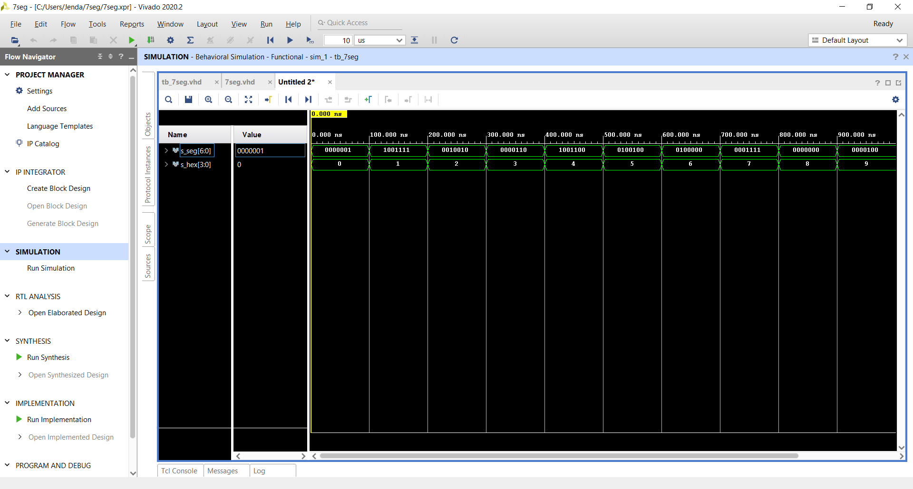
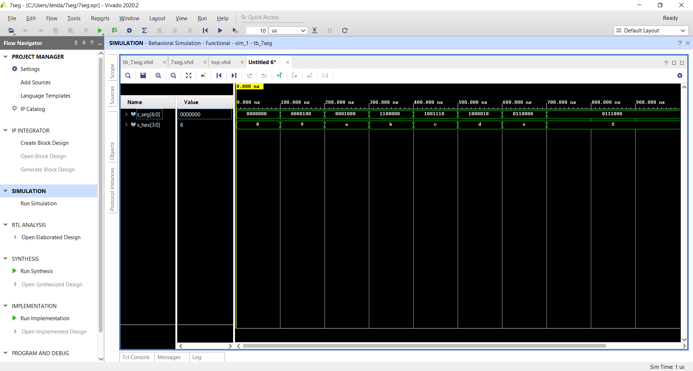
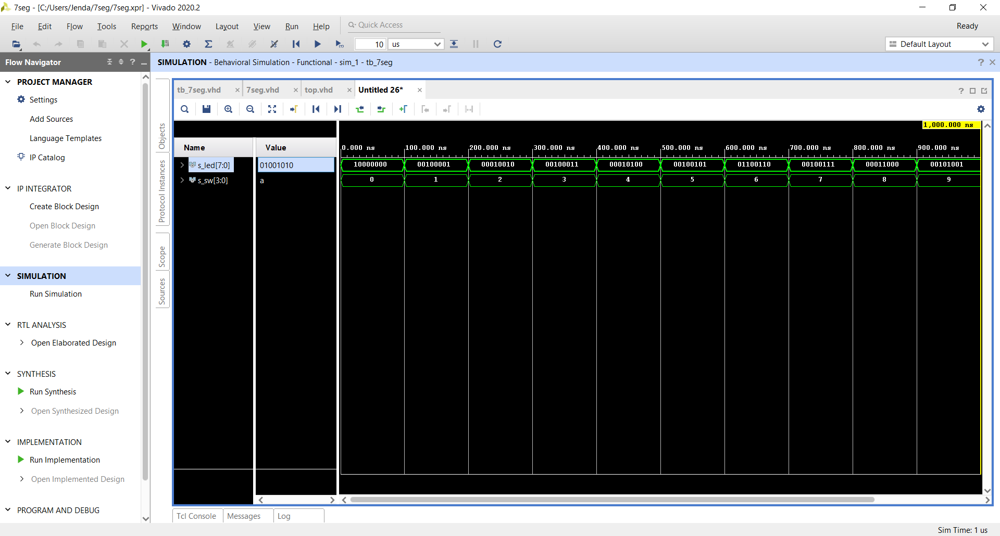

# Úkol 4

### Seven-segment display decoder
 
 

#### Architektura
```vhdl
architecture Behavioral of seg is

begin
seg_7 : process(hex_i)
begin
----------------------------36:30
        case hex_i is
                --8421
            when "0000" =>
                seg_o <= "0000001";     -- 0
            when "0001" =>
                seg_o <= "1001111";     -- 1
            when "0010" =>
                seg_o <= "0010010";--2
            when "0011" =>
                seg_o <= "0000110";--3
            when "0100" =>
                seg_o <= "1001100";--4
            when "0101" =>
                seg_o <= "0100100";--5                                                                
            when "0110" =>
                seg_o <= "0100000";--6
            when "0111" =>
                seg_o <= "0001111";--7
            when "1000" =>
                seg_o <= "0000000";--8
            when "1001" =>
                seg_o <= "0000100";--9
            when "1010" =>
                seg_o <= "0001000";--A
            when "1011" =>
                seg_o <= "1100000";--b
            when "1100" =>
                seg_o <= "1001110";--C
            when "1101" =>
                seg_o <= "1000010";--d
            when "1110" =>
                seg_o <= "0110000";--E
            when "1111" =>
                seg_o <= "0111000";--F                                                                                                                                                    
            when others =>
                seg_o <= "0111000";
        end case;
    end process seg_7;

end architecture behavioral;
```
#### Stimulus
```vhdl
p_stimulus : process
    begin       --8421
        s_hex <= "0000"; wait for 100 ns;--0
        s_hex <= "0001"; wait for 100 ns;--1
        s_hex <= "0010"; wait for 100 ns;--2
        s_hex <= "0011"; wait for 100 ns;--3
        s_hex <= "0100"; wait for 100 ns;--4
        s_hex <= "0101"; wait for 100 ns;--5
        s_hex <= "0110"; wait for 100 ns;--6
        s_hex <= "0111"; wait for 100 ns;--7
        s_hex <= "1000"; wait for 100 ns;--8
        s_hex <= "1001"; wait for 100 ns;--9 
        s_hex <= "1010"; wait for 100 ns;--A
        s_hex <= "1011"; wait for 100 ns;--b
        s_hex <= "1100"; wait for 100 ns;--C
        s_hex <= "1101"; wait for 100 ns;--d
        s_hex <= "1110"; wait for 100 ns;--E
        s_hex <= "1111"; wait for 100 ns;--F
                --8421
        report "Stimulus process finished" severity note;
        wait;
    end process p_stimulus;
```
| **Hex** | **Inputs** | **A** | **B** | **C** | **D** | **E** | **F** | **G** |
| :-: | :-: | :-: | :-: | :-: | :-: | :-: | :-: | :-: |
| 0 | 0000 | 0 | 0 | 0 | 0 | 0 | 0 | 1 |
| 1 | 0001 | 1 | 0 | 0 | 1 | 1 | 1 | 1 |
| 2 | 0010 | 0 | 0 | 1 | 0 | 0 | 1 | 0 |
| 3 | 0011 | 0 | 0 | 0 | 0 | 1 | 1 | 0 |
| 4 | 0100 | 1 | 0 | 0 | 1 | 1 | 0 | 0 |
| 5 | 0101 | 0 | 1 | 0 | 0 | 1 | 0 | 0 |
| 6 | 0110 | 0 | 1 | 0 | 0 | 0 | 0 | 0 |
| 7 | 0111 | 0 | 0 | 0 | 1 | 1 | 1 | 1 |
| 8 | 1000 | 0 | 0 | 0 | 0 | 0 | 0 | 0 |
| 9 | 1001 | 0 | 0 | 0 | 0 | 1 | 0 | 0 |
| A | 1010 | 0 | 0 | 0 | 1 | 0 | 0 | 0 |
| b | 1011 | 1 | 1 | 0 | 0 | 0 | 0 | 0 |
| C | 1100 | 1 | 0 | 0 | 1 | 1 | 1 | 0 |
| d | 1101 | 1 | 0 | 0 | 0 | 0 | 1 | 1 |
| E | 1110 | 0 | 1 | 1 | 0 | 0 | 0 | 0 |
| F | 1111 | 0 | 1 | 1 | 1 | 0 | 0 | 0 |
#### Top
```vhdl
entity top is
    Port ( SW  : in STD_LOGIC_VECTOR  (4-1 downto 0);
           LED : out STD_LOGIC_VECTOR (8-1 downto 0);
           AN  : out STD_LOGIC_VECTOR  (8-1 downto 0);
           CA  : out STD_LOGIC;
           CB  : out STD_LOGIC;
           CC  : out STD_LOGIC;
           CD  : out STD_LOGIC;
           CE  : out STD_LOGIC;
           CF  : out STD_LOGIC;
           CG  : out STD_LOGIC
           );
end top;

architecture Behavioral of top is

begin
 hex2seg : entity work.seg
    port map(
    hex_i    => SW,
    seg_o(6) => CA,
    seg_o(5) => CB,
    seg_o(4) => CC,
    seg_o(3) => CD,
    seg_o(2) => CE,
    seg_o(1) => CF,
    seg_o(0) => CG 
    );
    
  
```

### LED(7:4) indicators

#### Kód
```vhdl


    LED(3 downto 0) <= SW;  
                     -- 4567           --8421 
    LED(7 downto 4) <= "1000" when SW = "0000" else --0
                       "0100" when SW > "1001" else --9
                       "0010" when SW = "0001" else --1
                       "0010" when SW = "0011" else
                       "0010" when SW = "0101" else
                       "0010" when SW = "0111" else
                       "0010" when SW = "1001" else -- konec lichých
                       "0001" when SW = "0001" else -- mocniny dvou
                       "0001" when SW = "0010" else
                       "0001" when SW = "0100" else
                       "0001" when SW = "1000" else -- konec mocnin dvou
                       "0110"; -- není nikde
end Behavioral;
```
 
| **Hex** | **Inputs** | **LED4** | **LED5** | **LED6** | **LED7** |
| :-: | :-: | :-: | :-: | :-: | :-: |
| 0 | 0000 | 1 | 0 | 0 | 0 |
| 1 | 0001 | 0 | 0 | 1 | 0 |
| 2 | 0010 | 0 | 0 | 0 | 1 |
| 3 | 0011 | 0 | 0 | 1 | 0 |
| 4 | 0100 | 0 | 0 | 0 | 1 |
| 5 | 0101 | 0 | 0 | 1 | 0 |
| 6 | 0110 | 0 | 1 | 1 | 0 |
| 7 | 0111 | 0 | 0 | 1 | 0 |
| 8 | 1000 | 0 | 0 | 0 | 1 |
| 9 | 1001 | 0 | 0 | 1 | 0 |
| A | 1010 | 0 | 1 | 0 | 0 |
| b | 1011 | 0 | 1 | 0 | 0 |
| C | 1100 | 0 | 1 | 0 | 0 |
| d | 1101 | 0 | 1 | 0 | 0 |
| E | 1110 | 0 | 1 | 0 | 0 |
| F | 1111 | 0 | 1 | 0 | 0 |
