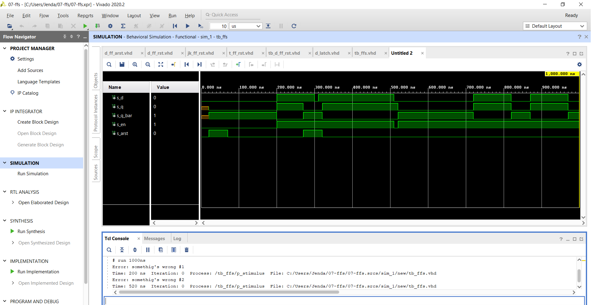
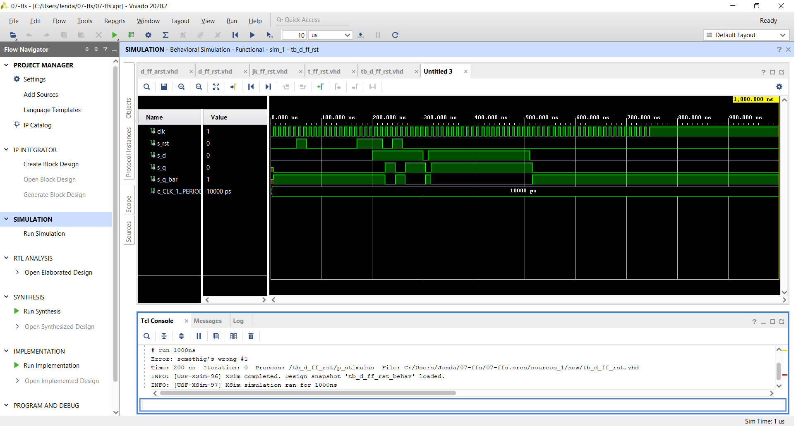
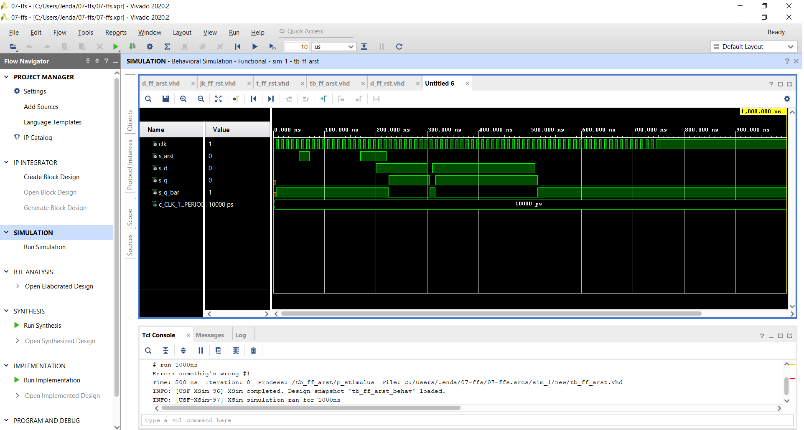
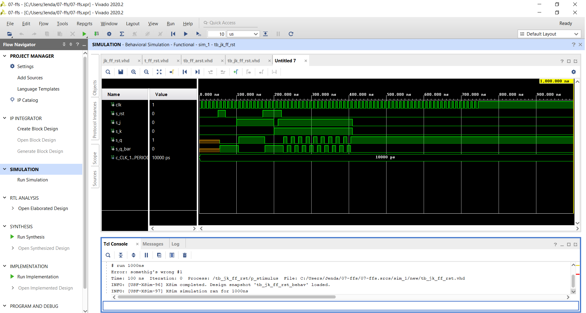
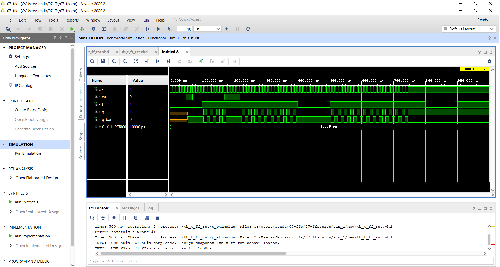

 ## Cv. 7
 
 ### Preparation task
 | **D** | **Qn** | **Q(n+1)** | **Comments** |
   | :-: | :-: | :-: | :-- |
   | 0 | 0 | 0 | Remember |
   | 0 | 1 | 0 | Remember |
   | 1 | 0 | 1 | Sample D |
   | 1 | 1 | 1 | Sample D |

   | **J** | **K** | **Qn** | **Q(n+1)** | **Comments** |
   | :-: | :-: | :-: | :-: | :-- |
   | 0 | 0 | 0 | 0 | No change |
   | 0 | 0 | 1 | 1 | No change |
   | 0 | 1 | 0 | 0 | Reset |
   | 0 | 1 | 1 | 0 | Reset |
   | 1 | 0 | 0 | 1 | Set |
   | 1 | 0 | 1 | 1 | Set |
   | 1 | 1 | 0 | 1 | Toggle |
   | 1 | 1 | 1 | 0 | Toggle |

   | **T** | **Qn** | **Q(n+1)** | **Comments** |
   | :-: | :-: | :-: | :-- |
   | 0 | 0 | 0 | No change |
   | 0 | 1 | 1 | No change |
   | 1 | 0 | 1 | Invert |
   | 1 | 1 | 0 | Invert |

### 2)
#### process
```vhdl
p_d_latch : process (d,arst,en)
begin
    if arst = '1' then
        q <= '0';
        q_bar <= '1';
    elsif (en = '1') then
        q <= d;
        q_bar <= not d;
    end if;
end process p_d_latch;
```
#### Stimulus of Test Bench
```vhdl
p_stimulus : process
        begin
            s_en <= '0';	
            s_d <= '0';			
            wait for 200 ns;
            s_d <= '1';
            s_en <= '1';	
            
            assert(s_q = '0' and s_q_bar = '0')
            report "somethig's wrong #1" severity error;
            			
            wait for 100 ns;
            s_d <= '0';
            s_en <= '1';				
            wait for 10 ns;		
            s_d <= '1';
            wait for 200 ns;
            s_en <= '0';	
            s_d <= '0';				
            wait for 10 ns;
            s_en <= '1';	
            
            assert(s_q = '1' and s_q_bar = '1')
            report "somethig's wrong #2" severity error;
            wait for 200 ns;
             s_d <= '1';				
            wait for 100 ns;
            s_d <= '0';				
            wait for 50 ns;		
            s_d <= '1';
            wait for 100 ns;	
            s_d <= '0';				
            wait for 100 ns;
            s_d <= '0';
            wait;                   
    end process p_stimulus;
```

### 3)

#### p_d_ff_rst + stimulus tb_d_ff_rst
```vhdl
p_d_ff_rst : process (rst, clk)
    begin
               if (rising_edge(clk)) then
                   if rst = '1' then
                       q     <= '0';
                       q_bar <= '1';
                   elsif (rising_edge(clk)) then
                       q <= d;
                       q_bar <= not d;
                   end if;
               end if;
    end process p_d_ff_rst;
    
    
    
    p_stimulus : process
        begin
            s_d <= '0';			
            wait for 200 ns;
            s_d <= '1';
            
            assert(s_q = '0' and s_q_bar = '0')
            report "somethig's wrong #1" severity error;
            			
            wait for 100 ns;
            s_d <= '0';
            wait for 10 ns;		
            s_d <= '1';
            wait for 200 ns;
            s_d <= '0';				
            wait for 10 ns;
            
            wait;                   
    end process p_stimulus;
```

#### p_d_ff_arst + stimulus
```vhdl
p_d_ff_arst : process (arst, clk)
    begin
        if arst = '1' then
            q     <= '0';
            q_bar <= '1';
        elsif (rising_edge(clk)) then
            q <= d;
            q_bar <= not d;
        end if;
    end process p_d_ff_arst;
    
    
    p_stimulus : process
        begin
            s_d <= '0';			
            wait for 200 ns;
            s_d <= '1';
            
            assert(s_q = '0' and s_q_bar = '0')
            report "somethig's wrong #1" severity error;
            			
            wait for 100 ns;
            s_d <= '0';
            wait for 10 ns;		
            s_d <= '1';
            wait for 200 ns;
            s_d <= '0';				
            wait for 10 ns;
            
            wait;                   
    end process p_stimulus;
```

#### p_jk_ff_rst + stimulus
```vhdl
p_jk_ff_rst : process (rst, clk)
            begin
                if (rising_edge(clk)) then
                    if rst = '1' then
                        s_q <= '0';
                    else
                        if (j = '0' and k = '0') then
                            s_q <= s_q;
                        elsif (j = '0' and k = '1') then
                            s_q <= '0';
                        elsif (j = '1' and k = '0') then
                            s_q <= '1';
                        elsif (j = '1' and k = '1') then
                            s_q <= not s_q;
                        end if;
                    end if;
                end if;
        end process p_jk_ff_rst;
        
        
        p_stimulus : process
        begin
            s_j <= '0';	
            s_k <= '0';		
            wait for 100 ns;
            s_j <= '1';
            s_k <= '0';
            assert(s_q = '0' and s_q_bar = '0')
            report "somethig's wrong #1" severity error;
            			
            wait for 100 ns;
            s_j <= '0';
            s_k <= '1';
            wait for 10 ns;		
            s_j <= '1';
            s_k <= '1';
            wait for 200 ns;
            s_j <= '0';
            s_k <= '0';				
            wait for 10 ns;
            
            wait;                   
    end process p_stimulus;
```

##### p_t_ff_rst + stimulus
```vhdl
p_t_ff_rst : process (rst, clk)
            begin
                if (rising_edge(clk)) then
                    if rst = '1' then
                        s_q <= '0';
                    else
                        if (t = '0' ) then
                            s_q <= s_q;
                        elsif (t = '1') then
                            s_q <= not s_q;
                       
                        end if;
                    end if;
                end if;
        end process p_t_ff_rst;
        
        
        p_stimulus : process
        begin
            
            s_t <= '0';		
            wait for 100 ns;
            s_t <= '1';
            assert(s_q = '0' and s_q_bar = '0')
            report "somethig's wrong #1" severity error;
            wait for 100 ns;
            s_t <= '1';
            wait for 100 ns;
            s_t <= '1';
            wait for 100 ns;
            s_t <= '1';
     end process;
```

