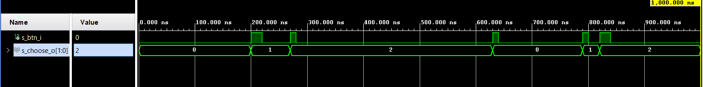

# Option module

## option.vhdl
```vhdl
----------------------------------------------------------------------------------
-- Company: BUT
-- Engineer: Jan Rajm
-- 
-- Create Date: 09.04.2021 11:19:38
-- Design Name: Option
-- Module Name: option - Behavioral
-- Project Name: VHDL project
-- Target Devices: Velocimeter
-- Tool Versions: 
-- Description: 
-- 
-- Dependencies: 
-- 
-- Revision:
-- Revision 0.01 - File Created
-- Additional Comments:
-- 
----------------------------------------------------------------------------------


library IEEE;
use IEEE.STD_LOGIC_1164.ALL;

-- Uncomment the following library declaration if using
-- arithmetic functions with Signed or Unsigned values
--use IEEE.NUMERIC_STD.ALL;

-- Uncomment the following library declaration if instantiating
-- any Xilinx leaf cells in this code.
--library UNISIM;
--use UNISIM.VComponents.all;

entity option is
  Port ( 
    btn_i    : in std_logic;                        -- input from button
    choose_o : out std_logic_vector(2 - 1 downto 0) -- output determinating which value will appear on display
  );
end option;

architecture Behavioral of option is
    -- definiton of states avaiable to be displayed
    type   state is (VELOCITY, AVG_VELOCITY,  DISTANCE);
                       
    signal s_state  : state;
    
begin
    p_choose_state : process(btn_i)
    begin
        case s_state is
            when VELOCITY =>
                if rising_edge(btn_i) then -- state is changed by every rising edge of button signal
                    s_state <= AVG_VELOCITY;
                end if;
            when AVG_VELOCITY =>
                if rising_edge(btn_i) then
                    s_state <= DISTANCE;
                end if;
            when DISTANCE =>
                if rising_edge(btn_i) then
                    s_state <= VELOCITY;
                end if;
            when others =>
                if rising_edge(btn_i) then
                    s_state <= VELOCITY;
                end if;
         end case;
    end process p_choose_state;
    
    p_output : process (s_state)
    begin
        
        case s_state is
            when VELOCITY =>
                choose_o <= "00"; -- this vector determinates which option will be displayed
            when AVG_VELOCITY =>
                choose_o  <= "01";   
            when DISTANCE =>
                choose_o  <= "10";   
            when others =>
                choose_o <= "00";
        end case;
    end process p_output;
    
end Behavioral;

```
## tb_option.vhdl
```vhdl
library ieee;
use ieee.std_logic_1164.all;

------------------------------------------------------------------------
-- Entity declaration for testbench
------------------------------------------------------------------------
entity tb_option is
    -- Entity of testbench is always empty
end entity tb_option;

------------------------------------------------------------------------
-- Architecture body for testbench
------------------------------------------------------------------------
architecture testbench of tb_option is

    --Local signals
   
    signal s_btn_i        :  std_logic;
    signal s_choose_o     :  std_logic_vector(2-1 downto 0);
    --signal s_state        :  std_logic;
    signal s_state        :  std_logic; 

begin
    uut_option: entity work.option
        port map (
           
            btn_i     => s_btn_i,
            choose_o  => s_choose_o
            --state   => s_state
        );
   
    --------------------------------------------------------------------
    -- Data generation process - simulation button presses
    --------------------------------------------------------------------
    p_stimulus : process
    begin
        report "Stimulus process started" severity note;
            s_btn_i <= '0';
            wait for 200 ns;
            s_btn_i <= '1';
            wait for 20 ns;
            s_btn_i <= '0';
            wait for 50 ns;
            s_btn_i <= '1';
            wait for 10 ns;
            s_btn_i <= '0';
            wait for 350 ns;
            s_btn_i <= '1';
            wait for 10 ns;
            s_btn_i <= '0';
            wait for 150 ns;
            s_btn_i <= '1';
            wait for 10 ns;
            s_btn_i <= '0';
            wait for 20 ns;
            s_btn_i <= '1';
            wait for 20 ns;
            s_btn_i <= '0';
            wait;
        report "Stimulus process finished" severity note;
        wait;
    end process p_stimulus;
end architecture testbench;

```
## Wavewforms
 
