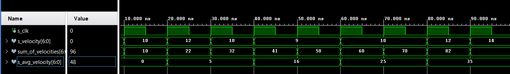

## avg_velocity.vhdl
```vhdl
----------------------
-- Made by Jan Rajm --
----------------------
library ieee;
use ieee.std_logic_1164.all;
use ieee.numeric_std.all;               -- Needed for shifts
entity e_avg_velocity is
    Port (
        clk : in std_logic;
        velocity : in std_logic_vector(7-1 downto 0)    
    );
end e_avg_velocity;
 
architecture behave of e_avg_velocity is
  signal s_avg_velocity        : unsigned(7-1 downto 0) := "0000000";
  signal sum_of_velocities     : unsigned(7-1 downto 0) := "0000000";
begin
 
p_avg_velocity : process(clk)
-- variable temp is used for clk division by 2. When temp is equal to 0, there is no shift
  variable count_of_shifts     : integer := 1;
  variable temp                : integer := 1;

    begin
    if rising_edge(clk) then
        sum_of_velocities <= sum_of_velocities + unsigned(velocity);    
        temp := 1-temp;
        -- Following code works as clock frequency divider by two. Usefull when dealing with division in binary.
        if temp = 1 then 
            s_avg_velocity <= shift_right(unsigned(sum_of_velocities), count_of_shifts);
            count_of_shifts := count_of_shifts;
        end if;
    end if;
 
  end process p_avg_velocity;
end architecture behave;
```
## tb_avg_velocity.vhdl
```vhdl
------------------------------------------------------------------------
--
-- Testbench for N-bit Up/Down binary counter.
-- Nexys A7-50T, Vivado v2020.1.1, EDA Playground
--
-- Copyright (c) 2020-Present Tomas Fryza
-- Dept. of Radio Electronics, Brno University of Technology, Czechia
-- This work is licensed under the terms of the MIT license.
--
------------------------------------------------------------------------

library ieee;
use ieee.std_logic_1164.all;

------------------------------------------------------------------------
-- Entity declaration for testbench
------------------------------------------------------------------------
entity tb_cnt_up_down is
    -- Entity of testbench is always empty
end entity tb_cnt_up_down; 

------------------------------------------------------------------------
-- Architecture body for testbench
------------------------------------------------------------------------
architecture testbench of tb_cnt_up_down is

    -- Number of bits for testbench counter

    --Local signals
    signal s_clk          : std_logic;
    signal s_velocity     : std_logic_vector(7-1 downto 0);

begin
    -- Connecting testbench signals with cnt_up_down entity
    -- (Unit Under Test)
    uut_avg_vel : entity work.e_avg_velocity
        
        port map(
            clk         => s_clk,
            velocity    => s_velocity
            
        );

    --------------------------------------------------------------------
    -- Clock generation process
    --------------------------------------------------------------------
    p_clk_gen : process
    begin
        while now < 750 ns loop         -- 75 periods of 100MHz clock
            s_clk <= '1';
            wait for 5 ns;
            s_clk <= '0';
            wait for 5 ns;
        end loop;
        wait;
    end process p_clk_gen;

    --------------------------------------------------------------------
    -- Data generation process
    --------------------------------------------------------------------
    p_stimulus : process
    begin
        s_velocity <= "0001000";
        wait for 10 ns;
        s_velocity <= "0001010";
        wait for 10 ns;
        s_velocity <= "0001100";
        wait for 10 ns;
        s_velocity <= "0001010";
        wait for 10 ns;
        s_velocity <= "0001001";
        wait for 10 ns;
        s_velocity <= "0001001";
        wait for 10 ns;
        s_velocity <= "0001010";
        wait for 10 ns;
        s_velocity <= "0001010";
        wait for 10 ns;
        s_velocity <= "0001100";
        wait for 10 ns;
        s_velocity <= "0001110";
        wait for 10 ns;
        s_velocity <= "0000000";
        wait;
    end process p_stimulus;

end architecture testbench;
```
 
- output value of avarage velocity for past two values of instantaneous speed
