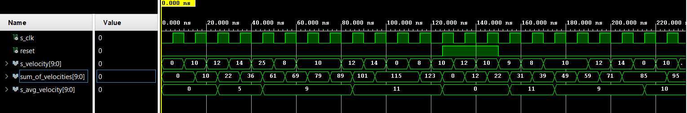
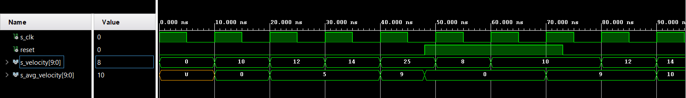
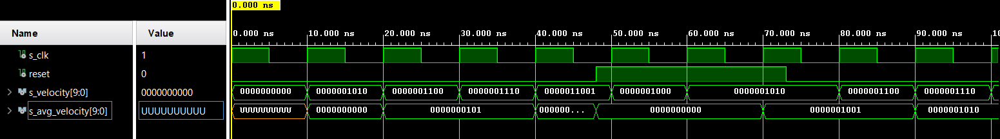

# Computation of avarage speed

## avg_velocity.vhdl
```vhdl
library ieee;
use IEEE.math_real.all;                 -- Needed for power
use ieee.std_logic_1164.all;            -- Basic library
use ieee.numeric_std.all;               -- Needed for shifts

entity e_avg_velocity is
    Port (
        clk1hz_i       : in std_logic;
        reset_i        : in std_logic;
        vel2avg_i      : in std_logic_vector(10-1 downto 0);
        avg_velocity_o : out unsigned(10-1 downto 0)  := "0000000000"  
    );
end e_avg_velocity;
 
architecture behave of e_avg_velocity is

  signal sum_of_velocities     : unsigned(10-1 downto 0) := "0000000000";
  
begin
 
p_avg_velocity : process(clk1hz_i, reset_i)

  variable count_of_shifts     : integer    := 1;
  variable clk_cycles          : integer    := 2; -- states for how many clock cycles does signal sum_of_velocities adds samples of 
                                                  --   velocity and for how long does process wait for division
    begin
    
    if rising_edge(reset_i) then
        avg_velocity_o      <= "0000000000"; -- zeroing value of avarage velocity
        sum_of_velocities   <= "0000000000"; -- zeroing of sum of velocities
        count_of_shifts := 1;
        clk_cycles      := 2; -- shift of one bit correspondents with waiting for two samples os velocity to be summed
    else
        if rising_edge(clk1hz_i) then 
                    
            sum_of_velocities <= sum_of_velocities + unsigned(vel2avg_i);             
                
            if clk_cycles = 0 then
                avg_velocity_o <= shift_right(unsigned(sum_of_velocities), count_of_shifts); -- division of summed velocities 
                count_of_shifts := count_of_shifts + 1;                                    --   in order to compute avarage velocity
                clk_cycles := 2**(count_of_shifts - 1); 
            end if;
        
            clk_cycles := clk_cycles - 1;        
          
        end if;
    end if;
  end process p_avg_velocity;
end architecture behave;
```
## tb_avg_velocity.vhdl
```vhdl
------------------------------------------------------------------------
--
-- Testbench for N-bit Up/Down binary counter.
-- Nexys A7-50T, Vivado v2020.1.1, EDA Playground
--
-- Copyright (c) 2020-Present Tomas Fryza
-- Dept. of Radio Electronics, Brno University of Technology, Czechia
-- This work is licensed under the terms of the MIT license.
--
------------------------------------------------------------------------

library ieee;
use ieee.std_logic_1164.all;

------------------------------------------------------------------------
-- Entity declaration for testbench
------------------------------------------------------------------------
entity tb_cnt_up_down is
    -- Entity of testbench is always empty
end entity tb_cnt_up_down; 

------------------------------------------------------------------------
-- Architecture body for testbench
------------------------------------------------------------------------
architecture testbench of tb_cnt_up_down is

    -- Number of bits for testbench counter

    --Local signals
    signal s_clk          : std_logic;
    signal reset          : std_logic;
    signal s_velocity     : std_logic_vector(10-1 downto 0);
    signal s_avg_velocity : std_logic_vector(10-1 downto 0);

begin
    -- Connecting testbench signals with cnt_up_down entity
    -- (Unit Under Test)
    uut_avg_vel : entity work.e_avg_velocity
        
        port map(
            clk1hz_i                         => s_clk,
            vel2avg_i                        => s_velocity,
            reset_i                          => reset,
            std_logic_vector(avg_velocity_o) => s_avg_velocity
        );

    --------------------------------------------------------------------
    -- Clock generation process
    --------------------------------------------------------------------
    p_clk_gen : process
    begin
        while now < 750 ns loop         -- 75 periods of 100MHz clock
            s_clk <= '0';
            wait for 5 ns;
            s_clk <= '1';
            wait for 5 ns;
        end loop;
        wait;
    end process p_clk_gen;
    
    --------------------------------------------------------------------
    -- Reset generation process
    --------------------------------------------------------------------
    p_reset : process
    begin
        reset <= '0';
        wait for 125 ns;
        reset <= '1';
        wait for 25 ns;
        reset <= '0';
        wait for 220 ns;
        reset <= '0';
        wait for 17ns;
        reset <= '0';
        wait;
    end process p_reset;

    --------------------------------------------------------------------
    -- Velocity generation process
    --------------------------------------------------------------------
    p_stimulus : process
    begin
        s_velocity <= "0000000000";
        wait for 10 ns;
        s_velocity <= "0000001010";
        wait for 10 ns;
        s_velocity <= "0000001100";
        wait for 10 ns;
        s_velocity <= "0000001110";
        wait for 10 ns;
        s_velocity <= "0000011001";
        wait for 10 ns;
        s_velocity <= "0000001000";
        wait for 10 ns;
        s_velocity <= "0000001010";
        wait for 10 ns;
        s_velocity <= "0000001010";
        wait for 10 ns;
        s_velocity <= "0000001100";
        wait for 10 ns;
        s_velocity <= "0000001110";
        wait for 10 ns;
        s_velocity <= "0000000000";
        wait for 10 ns;
        s_velocity <= "0000001000";
        wait for 10 ns;
        s_velocity <= "0000001010";
        wait for 10 ns;
        s_velocity <= "0000001100";
        wait for 10 ns;
        s_velocity <= "0000001010";
        wait for 10 ns;
        s_velocity <= "0000001001";
        wait for 10 ns;
        s_velocity <= "0000001000";
        wait for 10 ns;
        s_velocity <= "0000001010";
        wait for 10 ns;
        s_velocity <= "0000001010";
        wait for 10 ns;
        s_velocity <= "0000001100";
        wait for 10 ns;
        s_velocity <= "0000001110";
        wait for 10 ns;
        s_velocity <= "0000000000";
    end process p_stimulus;

end architecture testbench;

```
 
 
 


## Notes
- Rounding creates some errors. In our application these errors are negligible. 
