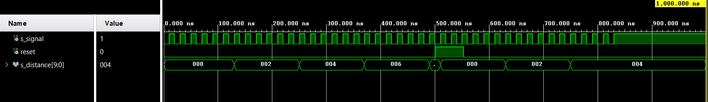

## Distance

### distance.vhdl
```vhdl
----------------------------------------------------------------------------------
-- Company: BUT
-- Engineer: Jan Rajm
-- 
-- Create Date: 28.04.2021 13:40:20
-- Design Name: Distance meter
-- Module Name: distance - Behavioral
-- Project Name: VHDL school project
-- Target Devices: Tachometer 
-- Tool Versions: 
-- Description: 
-- 
-- Dependencies: 
-- 
-- Revision:
-- Revision 0.01 - File Created
-- Additional Comments:
-- 
----------------------------------------------------------------------------------


library IEEE;
use IEEE.STD_LOGIC_1164.ALL;
use ieee.numeric_std.all;

-- Uncomment the following library declaration if using
-- arithmetic functions with Signed or Unsigned values
--use IEEE.NUMERIC_STD.ALL;

-- Uncomment the following library declaration if instantiating
-- any Xilinx leaf cells in this code.
--library UNISIM;
--use UNISIM.VComponents.all;

entity distance is
  Port ( 
    sensor_i     : in std_logic;
    reset_i    : in std_logic;
    distance_o : out std_logic_vector(10-1 downto 0) := "0000000000"
  );
end distance;

architecture Behavioral of distance is

    signal s_distance : unsigned(10-1 downto 0) := "0000000000"; -- necessary for summing

    begin
        p_distance : process(sensor_i, reset_i)
        
        variable sum : integer := 0; -- counts input signals 
        
        begin
            if rising_edge(reset_i) then
                sum := 0;
                s_distance <= "0000000000";
            else
                if rising_edge(sensor_i) then
                    sum := sum + 1;
                    if sum > 500 then --for simulation purpouse used if sum > 5 then (...). We consider wheel with circuit of 2m thus 1km means 500 revolutions. 
                      sum := 0;
                      s_distance <= s_distance + "0000000001";    
                    end if;
                    --distance_o <= std_logic_vector(s_distance);
                 end if;
                 
                 distance_o <= std_logic_vector(s_distance);
                 
            end if;
        end process p_distance;
        
end Behavioral;


```

### tb_distance.vhdl
```vhdl
------------------------------------------------------------------------
--
-- Template for 4-digit 7-segment display driver testbench.
-- Nexys A7-50T, Vivado v2020.1.1, EDA Playground
--
-- Copyright (c) 2020 Tomas Fryza
-- Dept. of Radio Electronics, Brno University of Technology, Czechia
-- This work is licensed under the terms of the MIT license.
--
------------------------------------------------------------------------

library ieee;
use ieee.std_logic_1164.all;

------------------------------------------------------------------------
-- Entity declaration for testbench
------------------------------------------------------------------------
entity tb_distance is
    -- Entity of testbench is always empty
end entity tb_distance;

------------------------------------------------------------------------
-- Architecture body for testbench
------------------------------------------------------------------------
architecture testbench of tb_distance is

    signal s_signal     :  std_logic;
    signal reset        :  std_logic;
    signal s_distance   :  std_logic_vector(10-1 downto 0);
    
begin
    uut_driver_7_seg: entity work.distance
        port map (
            
            TEMP_i     =>  s_signal,
            reset_i    =>  reset,
            distance_o => s_distance
        );
    p_reset_gen : process
    begin
        reset <= '0';
        wait for 500 ns;
        reset <= '1';
        wait for 53 ns;
        reset <= '0';
        wait;
    end process p_reset_gen;
    
    p_stimulus : process
    begin
        s_signal <= '0';
        wait for 10 ns;
        s_signal <= '1';
        wait for 10 ns;
        s_signal <= '0';
        wait for 10 ns;
        s_signal <= '1';
        wait for 10 ns;
        s_signal <= '0';
        wait for 10 ns;
        s_signal <= '1';
        wait for 10 ns;
        s_signal <= '0';     
        wait for 10 ns;
        s_signal <= '1';
        wait for 10 ns;
        s_signal <= '0';
        wait for 10 ns;
        s_signal <= '1';
        wait for 10 ns;
        s_signal <= '0';
        wait for 10 ns;
        s_signal <= '1';
        wait for 10 ns;
        s_signal <= '0';
        wait for 10 ns;
        s_signal <= '1';
        wait for 10 ns;
        s_signal <= '0';
        wait for 10 ns;
        s_signal <= '1';
        wait for 10 ns;
        s_signal <= '0';
        wait for 10 ns;
        s_signal <= '1';
        wait for 10 ns;
        s_signal <= '0';
        wait for 10 ns;
        s_signal <= '1';
        wait for 10 ns;
        s_signal <= '0';
        wait for 10 ns;
        s_signal <= '1';
        wait for 10 ns;
        s_signal <= '0';
        wait for 10 ns;
        s_signal <= '1';
        wait for 10 ns;
        s_signal <= '0';
        wait for 10 ns;
        s_signal <= '1';
        wait for 10 ns;
        s_signal <= '0';
        wait for 10 ns;
        s_signal <= '1';
        wait for 10 ns;
        s_signal <= '0';
        wait for 10 ns;
        s_signal <= '1';
        wait for 10 ns;
        s_signal <= '0';
        wait for 10 ns;
        s_signal <= '1';
        wait for 10 ns;
        s_signal <= '0';
        wait for 10 ns;
        s_signal <= '1';
        wait for 10 ns;
        s_signal <= '0';     
        wait for 10 ns;
        s_signal <= '1';
        wait for 10 ns;
        s_signal <= '0';
        wait for 10 ns;
        s_signal <= '1';
        wait for 10 ns;
        s_signal <= '0';
        wait for 10 ns;
        s_signal <= '1';
        wait for 10 ns;
        s_signal <= '0';
        wait for 10 ns;
        s_signal <= '1';
        wait for 10 ns;
        s_signal <= '0';
        wait for 10 ns;
        s_signal <= '1';
        wait for 10 ns;
        s_signal <= '0';
        wait for 10 ns;
        s_signal <= '1';
        wait for 10 ns;
        s_signal <= '0';
        wait for 10 ns;
        s_signal <= '1';
        wait for 10 ns;
        s_signal <= '0';
        wait for 10 ns;
        s_signal <= '1';
        wait for 10 ns;
        s_signal <= '0';
        wait for 10 ns;
        s_signal <= '1';
        wait for 10 ns;
        s_signal <= '0';
        wait for 10 ns;
        s_signal <= '1';
        wait for 10 ns;
        s_signal <= '0';
        wait for 10 ns;
        s_signal <= '1';
        wait for 10 ns;
        s_signal <= '0';
        wait for 10 ns;
        s_signal <= '1';
        wait for 10 ns;
        s_signal <= '0';
        wait for 10 ns;
        s_signal <= '1';
        wait for 10 ns;
        s_signal <= '0';
        wait for 10 ns;
        s_signal <= '1';
        wait for 10 ns;
        s_signal <= '0';     
        wait for 10 ns;
        s_signal <= '1';
        wait for 10 ns;
        s_signal <= '0';
        wait for 10 ns;
        s_signal <= '1';
        wait for 10 ns;
        s_signal <= '0';
        wait for 10 ns;
        s_signal <= '1';
        wait for 10 ns;
        s_signal <= '0';
        wait for 10 ns;
        s_signal <= '1';
        wait for 10 ns;
        s_signal <= '0';
        wait for 10 ns;
        s_signal <= '1';
        wait for 10 ns;
        s_signal <= '0';
        wait for 10 ns;
        s_signal <= '1';
        wait for 10 ns;
        s_signal <= '0';
        wait for 10 ns;
        s_signal <= '1';
        wait for 10 ns;
        s_signal <= '0';
        wait for 10 ns;
        s_signal <= '1';
        wait for 10 ns;
        s_signal <= '0';
        wait for 10 ns;
        s_signal <= '1';
        wait for 10 ns;
        s_signal <= '0';
        wait for 10 ns;
        s_signal <= '1';
        wait for 10 ns;
        s_signal <= '0';
        wait for 10 ns;
        s_signal <= '1';
        wait for 10 ns;
        
        wait;
    end process p_stimulus;
end architecture testbench;
```

