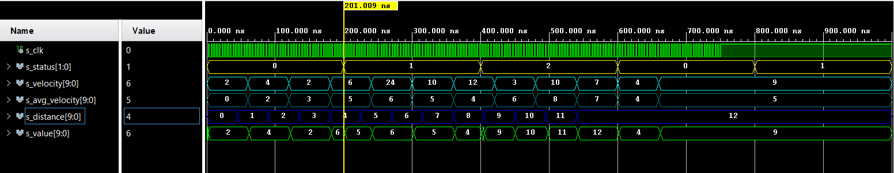

## Output

### output.vhdl
```vhdl
----------------------------------------------------------------------------------
-- Company: BUT
-- Engineer: Jan Rajm
-- 
-- Create Date: 29.04.2021 15:02:31
-- Design Name: output module
-- Module Name: output - Behavioral
-- Project Name: VHDL school project
-- Target Devices: tachometer
-- Tool Versions: 
-- Description: 
-- 
-- Dependencies: 
-- 
-- Revision:
-- Revision 0.01 - File Created
-- Additional Comments:
-- 
----------------------------------------------------------------------------------


library IEEE;
use IEEE.STD_LOGIC_1164.ALL;

-- Uncomment the following library declaration if using
-- arithmetic functions with Signed or Unsigned values
--use IEEE.NUMERIC_STD.ALL;

-- Uncomment the following library declaration if instantiating
-- any Xilinx leaf cells in this code.
--library UNISIM;
--use UNISIM.VComponents.all;

entity output is
  Port ( 
    clk_i          : in  std_logic;
    status_i       : in  std_logic_vector(2-1 downto 0);
    distance_i     : in  std_logic_vector(10-1 downto 0);
    avg_velocity_i : in  std_logic_vector(10-1 downto 0);
    velocity_i     : in  std_logic_vector(10-1 downto 0);
    value_o        : out std_logic_vector(10-1 downto 0)
  );
end output;

architecture Behavioral of output is

begin
p_output : process(status_i, clk_i)
    begin
        if rising_edge(clk_i) then
            case status_i is
                when "00" =>
                    value_o <= velocity_i;
                when "01" =>
                    value_o <= avg_velocity_i;
                when "10" =>
                    value_o <= distance_i;
                when others =>
                    value_o <= velocity_i;
            end case;
        end if;
    end process p_output;

end Behavioral;

```
### tb_output.vhdl
```vhdl
----------------------------------------------------------------------------------
-- Company: VUT FEKT
-- Engineer: Jan Rajm
-- 
-- Design Name: output module
-- Project Name: bicycle tachometer
-- Target Devices: Nexys A7-35
-- 
----------------------------------------------------------------------------------


library IEEE;
use IEEE.STD_LOGIC_1164.ALL;

-- Uncomment the following library declaration if using
-- arithmetic functions with Signed or Unsigned values
--use IEEE.NUMERIC_STD.ALL;

-- Uncomment the following library declaration if instantiating
-- any Xilinx leaf cells in this code.
--library UNISIM;
--use UNISIM.VComponents.all;

entity tb_clock is
--  Port ( );
end tb_clock;

architecture Behavioral of tb_clock is
    signal s_clk          :  std_logic;
    signal s_status       :  std_logic_vector(2-1 downto 0);
    signal s_distance     :  std_logic_vector(10-1 downto 0);
    signal s_avg_velocity :  std_logic_vector(10-1 downto 0);
    signal s_velocity     :  std_logic_vector(10-1 downto 0);
    signal s_value        :  std_logic_vector(10-1 downto 0);
begin
    uut_clock : entity work.output
        port map(
            clk_i          => s_clk,
            status_i       => s_status,
            distance_i     => s_distance,
            avg_velocity_i => s_avg_velocity,
            velocity_i     => s_velocity,
            value_o        => s_value
                );
                
    p_clk_gen : process
    begin
        while now < 750 ns loop         -- 75 periods of 100MHz clock
            s_clk <= '0';
            wait for 2 ns;
            s_clk <= '1';
            wait for 2 ns;
        end loop;
        wait;
    end process p_clk_gen;
                
    p_status : process
    begin
        s_status <= "00";
        wait for 200 ns;
        s_status <= "01";
        wait for 200 ns;
        s_status <= "10";
        wait for 200 ns;
        s_status <= "11"; -- intentionaly unexpected value    
    end process p_status;
    
    p_distance : process
    begin
        s_distance <= "0000000000";
        wait for 45 ns;
        s_distance <= "0000000001";
        wait for 45 ns;
        s_distance <= "0000000010";
        wait for 45 ns;
        s_distance <= "0000000011";
        wait for 45 ns;
        s_distance <= "0000000100";
        wait for 45 ns;
        s_distance <= "0000000101";
        wait for 45 ns;
        s_distance <= "0000000110";
        wait for 45 ns;
        s_distance <= "0000000111";
        wait for 45 ns;
        s_distance <= "0000001000";
        wait for 45 ns;
        s_distance <= "0000001001";
        wait for 45 ns;
        s_distance <= "0000001010";
        wait for 45 ns;
        s_distance <= "0000001011";
        wait for 45 ns;
        s_distance <= "0000001100";
        wait;
    end process p_distance;
    
    p_avg_velocity : process
    begin
        s_avg_velocity <= "0000000000";
        wait for 60 ns;
        s_avg_velocity <= "0000000010";
        wait for 60 ns;
        s_avg_velocity <= "0000000011";
        wait for 60 ns;
        s_avg_velocity <= "0000000101";
        wait for 60 ns;
        s_avg_velocity <= "0000000110";
        wait for 60 ns;
        s_avg_velocity <= "0000000101";
        wait for 60 ns;
        s_avg_velocity <= "0000000100";
        wait for 60 ns;
        s_avg_velocity <= "0000000110";
        wait for 60 ns;
        s_avg_velocity <= "0000001000";
        wait for 60 ns;
        s_avg_velocity <= "0000000111";
        wait for 60 ns;
        s_avg_velocity <= "0000000100";
        wait for 60 ns;
        s_avg_velocity <= "0000000101";
        wait for 60 ns;
        wait;
    end process p_avg_velocity;
    
    p_velocity : process
    begin
        s_velocity <= "0000000010";
        wait for 60 ns;
        s_velocity <= "0000000100";
        wait for 60 ns;
        s_velocity <= "0000000010";
        wait for 60 ns;
        s_velocity <= "0000000110";
        wait for 60 ns;
        s_velocity <= "0000011000";
        wait for 60 ns;
        s_velocity <= "0000001010";
        wait for 60 ns;
        s_velocity <= "0000001100";
        wait for 60 ns;
        s_velocity <= "0000000011";
        wait for 60 ns;
        s_velocity <= "0000001010";
        wait for 60 ns;
        s_velocity <= "0000000111";
        wait for 60 ns;
        s_velocity <= "0000000100";
        wait for 60 ns;
        s_velocity <= "0000001001";
        wait for 60 ns;
        wait;
    end process p_velocity;
    
end Behavioral;
```
#### Notes
- Dosen't matter that avarage velocity dosen't match with velocity. This values are just for demonstration purpouse.
- Unexpected value of __s_status__ was succesfully handeled. 
 

